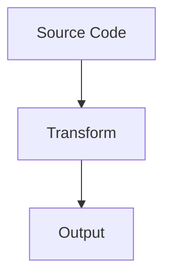
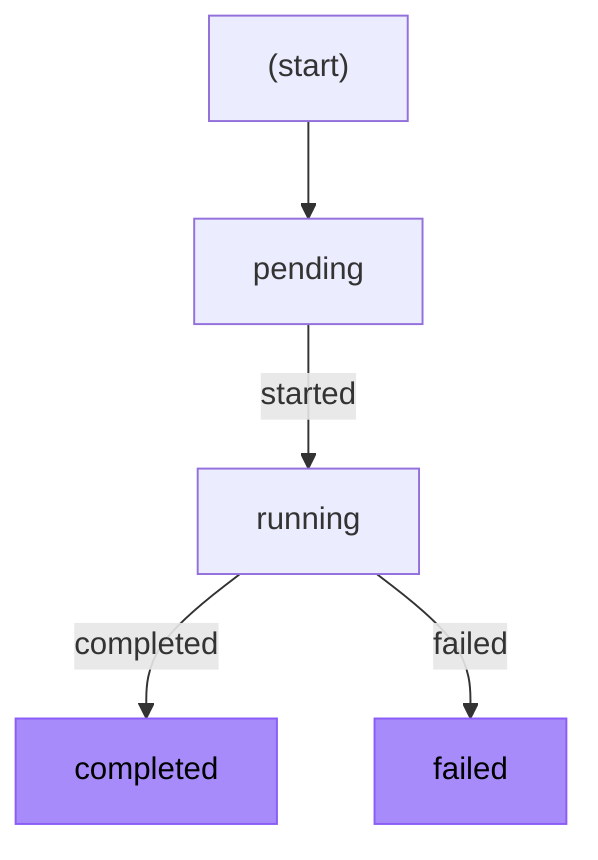

# Workflow DevKit Docs

Check out the docs [here](https://useworkflow.dev/)

## Mermaid Diagram Style Guide

When adding diagrams to documentation, follow these conventions for consistency.

### Diagram Type

Use `flowchart TD` (top-down) or `flowchart LR` (left-right) for flow diagrams:



### Node Syntax

Use square brackets with double quotes for rectangular nodes:

```
A["Label Text"]           # Correct - rectangular node
A[Label Text]             # Avoid - can cause parsing issues
A(Label Text)             # Avoid - rounded node, inconsistent style
```

### Edge Labels

Use the pipe syntax with double quotes for edge labels:

```
A -->|"label"| B          # Correct
A --> B                   # Correct (no label)
```

### Highlighting Important Nodes

Use the purple color scheme to highlight terminal states or key components:

```
style NodeId fill:#a78bfa,stroke:#8b5cf6,color:#000
```

Place all `style` declarations at the end of the diagram.

### Complete Example



### Guidelines

- Keep diagrams simple and readable
- Use meaningful node labels
- Limit complexity - split into multiple diagrams if needed
- Add a legend or callout explaining highlighted nodes when appropriate
